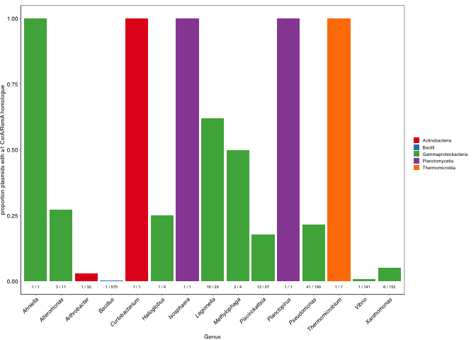
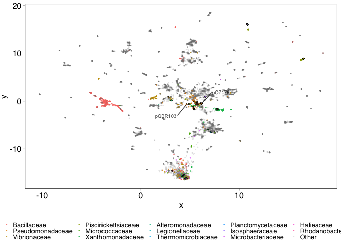

1. Bioinformatic analyses of plasmid-borne RsmA
================
jpjh
November 2021

### 1.1 Identification of RsmA homologues from plasmids in databases

Questions:

-   What plasmids are RsmA homologues on?
-   What are the sequences of these genes?
-   What kinds of plasmids are these sequences on?

COMPASS plasmid database was annotated using
[PROKKA](https://github.com/tseemann/prokka), with default settings:
PROKKA uses UniProtKB (SwissProt) databases to annotate.

Link to annotation in `./ref/COMPASS_prokka.gff` and
`./ref/COMPASS_prokka.faa`.

Identify genes annotated as ‘CsrA’ or ‘Carbon storage regulator’

``` bash
grep "[Cc]srA" ./ref/COMPASS_prokka.gff | wc -l # 106
grep "[Cc]arbon storage regulator" ./ref/COMPASS_prokka.gff | wc -l # 11
```

Note: searching for ‘\[Rr\]smA’ gives 14 hits, ‘all Ribosomal RNA small
subunit methyltransferase A’, which is irrelevant.

Note: no additional matches when looking for “\[Cc\]arbon storage”.

Note: all hits with “\[Cc\]arbon storage regulator” also matched
“\[Cc\]srA”.

This gives us our list of CsrA-like genes in COMPASS. Need to match
these up with the overall COMPASS metadata to get a table with plasmid
details and CsrA sequence.

``` bash
grep "[Cc]srA\|[Cc]arbon storage regulator" ./ref/COMPASS_prokka.faa \
  | sed 's/>//g' > ./working_1/COMPASS_CsrA_matches.txt
  
seqtk subseq ./ref/COMPASS_prokka.faa \
  ./working_1/COMPASS_CsrA_matches.txt \
  | awk '{print $1}' \
  | tr '\n' '\t' | tr '>' '\n' \
  > ./working_1/COMPASS_CsrA_matches.tsv
  
seqtk subseq ./ref/COMPASS_prokka.ffn \
  ./working_1/COMPASS_CsrA_matches.txt \
  | awk '{print $1}' \
  | tr '\n' '\t' | tr '>' '\n' \
  > ./working_1/COMPASS_CsrA_matches_na.tsv  
  
grep "[Cc]srA\|[Cc]arbon storage regulator" ./ref/COMPASS_prokka.gff \
  > ./working_1/COMPASS_prokka_CsrA_matches.gff
```

Load into R and join with plasmid details.

Note: using the full table from COMPASS to join, which probably results
in some duplicates.

``` r
# Note: eval is set to FALSE as a workaround to deal with the fact 
#    that Rmarkdown doesn't work with symbolic links. 
# This code was run in advance to prepare the local .rds files for analysis

source("./func/gff_functions.R")

comp <- read.csv("./ref/COMPASS.csv", row.names = NULL, sep=";")
dups <- read.csv("./ref/COMPASS_duplicates_by_accession.txt", header=FALSE)
gff <- gffRead("./working_1/COMPASS_prokka_CsrA_matches.gff")

write_rds(file="./working_1/comp.rds", comp)
write_rds(file="./working_1/dups.rds", dups)
write_rds(file="./working_1/gff.rds", gff)
```

Make some diagnostic plots. Note: `comp` is the full COMPASS database,
`compass` is with duplicates removed.

``` r
source("./func/gff_functions.R")

csra_seqs <- read.table("./working_1/COMPASS_CsrA_matches.tsv",
                        col.names=c("ID","seq"))

comp <- read_rds("./working_1/comp.rds")
dups <- read_rds("./working_1/dups.rds")
gff <- read_rds("./working_1/gff.rds")

compass <- comp %>% filter(!(Accession %in% dups$V1))

csra_gff <- data.frame(Accession = gff$seqname,
                       start = gff$start,
                       end = gff$end,
                       strand = gff$strand,
                       ID = getAttributeField(gff$attributes, "ID"))

# Note: using the full table from COMPASS to join, which probably results in some duplicates.

plasmid_csra <- csra_gff %>% left_join(csra_seqs, by="ID") %>%
  left_join(comp, by="Accession")

plasmid_csra %>% filter(duplicated(seq)) %>% nrow() # 55 sequences are identical to others in the database at the AA level
```

    ## [1] 55

``` r
# are these duplications within Genus, or are there duplicates in different Genera?

plasmid_csra %>% group_by(seq, Genus) %>% count() %>% filter(duplicated(seq)) %>% nrow() 
```

    ## [1] 0

``` r
# No duplicates across genus, so all duplicates are duplicated within Genus.

plasmid_csra <- plasmid_csra %>% mutate(Duplicated = factor(ifelse(duplicated(seq), "Y", "N"),
                                                            levels=c("Y","N")))

write.table(unique(plasmid_csra$Accession), 
            file="./working_1/plasmid_csra_accessions.txt", col.names = FALSE,
            quote=FALSE, row.names = FALSE)
```

The NA is a Xanthomondales bacterium, [*Ahniella
afigens*](https://www.ncbi.nlm.nih.gov/Taxonomy/Browser/wwwtax.cgi?id=2021234)
(Rhodanobacteriaceae). Manually annotate this line.

``` r
plasmid_csra %>% filter(is.na(Genus))
```

    ##       Accession  start    end strand              ID
    ## 1 NZ_CP027861.1 146830 146997      - compass_1329038
    ##                                                       seq
    ## 1 MLILKRRIEECIQIKVPGQDPILVTILKIVDGHVEVGIDAPRTVEVRRAQKDHTK
    ##                                                        Description Topology
    ## 1 Xanthomonadales bacterium D13 plasmid unnamed, complete sequence circular
    ##   Size..bp.         Phylum               Class           Order Family Genus
    ## 1    149386 Proteobacteria Gammaproteobacteria Xanthomonadales   <NA>  <NA>
    ##                         Species Plasmid Strain Collection.date
    ## 1 Xanthomonadales bacterium D13 unnamed    D13         juil-15
    ##                  Country REP.types MOB.types MPF.types OriT.types
    ## 1 South Korea: Shnan-gun      <NA>      <NA>      <NA>       <NA>
    ##   Predicted.Mobility Duplicated
    ## 1    Non-mobilizable          N

``` r
compass[compass$Accession=="NZ_CP027861.1",
        c("Family","Genus")] <- c("Rhodanobacteraceae","Ahniella")

plasmid_csra[plasmid_csra$Accession=="NZ_CP027861.1",
             c("Family","Genus")] <- c("Rhodanobacteraceae","Ahniella")
```

Get overall statistics for distribution.

``` r
nrow(plasmid_csra) # 106 csrA genes total
```

    ## [1] 106

``` r
plasmid_csra %>% filter(!duplicated(Accession)) %>% nrow() # across 98 plasmids
```

    ## [1] 98

``` r
plasmid_csra %>% group_by(Class, Accession) %>% summarise(n = n()) %>% 
  summarise(n = n()) %>% kable() #92/98 from Gammaproteobacteria
```

    ## `summarise()` has grouped output by 'Class'. You can override using the `.groups` argument.

| Class               |   n |
|:--------------------|----:|
| Actinobacteria      |   2 |
| Bacilli             |   1 |
| Gammaproteobacteria |  92 |
| Planctomycetia      |   2 |
| Thermomicrobia      |   1 |

Plot CsrA homologues across Genera.

``` r
ggplot(data=plasmid_csra, aes(x=Genus)) + geom_bar() + theme_pub() +
  theme(axis.text.x = element_text(face="italic", angle=45, hjust=1))
```

<!-- -->

``` r
(plot_bar_Class <- ggplot(data=plasmid_csra, aes(x=Genus, fill=Class, alpha=Duplicated)) + geom_bar() + 
  scale_fill_brewer(type="qual", palette=6, name="") + 
  labs(y = "# plasmid-borne CsrA/RsmA homologues") + 
  scale_alpha_manual(values=c(0.5,1)) + theme_pub() +
  theme(axis.text.x = element_text(face="italic", angle=45, hjust=1), legend.position="right"))
```

<!-- -->

``` r
png(filename="./figs/1_1_bar_by_genus.png", height=3, width=4.5, units="in", res=300)
plot_bar_Class + theme_pub() +
  theme(axis.text.x = element_text(face="italic", angle=45, hjust=1), legend.position="right")
dev.off()
```

    ## quartz_off_screen 
    ##                 2

Shows almost all (>93%) come from Gammaproteobacteria. Within
Gammaproteobacteria, about 40% have at least one duplicate at the
amino-acid level in the database.

How does this compare with plasmid size and other features? Plot
CsrA-containing plasmids onto a density plot for each Family. For this,
remove the duplicates, because they can confuse the density plot, and
remove all Families with \<20 plasmids.

``` r
compass <- compass %>% mutate(encodes_csra = ifelse(Accession %in% plasmid_csra$Accession, "Y", "N"))

compass %>% filter(encodes_csra == "Y") %>% arrange(Size..bp.) %>% select(Description, Size..bp.) %>%
  head() %>% kable()
```

| Description                                                                           | Size..bp. |
|:--------------------------------------------------------------------------------------|----------:|
| Methylophaga nitratireducenticrescens strain GP59 plasmid pGP59-32, complete sequence |     32421 |
| Pseudomonas alcaligenes plasmid pRA2, complete sequence                               |     32743 |
| Methylophaga nitratireducenticrescens strain GP59 plasmid pGP59-34, complete sequence |     33560 |
| Pseudomonas syringae pv. actinidiae ICMP 9853 plasmid p9853_A, complete sequence      |     34963 |
| Planctopirus limnophila DSM 3776 plasmid pPLIM01, complete sequence                   |     37010 |
| Pseudomonas fluorescens strain PC20 plasmid pPHE20, complete sequence                 |     39609 |

``` r
csra_families <- plasmid_csra$Family %>% unique()

compass_subset_fam <- filter(compass, Family %in% csra_families)

(counts_family <- compass_subset_fam %>% group_by(Family, encodes_csra) %>% 
    summarise(total = n()) %>% pivot_wider(names_from=encodes_csra, values_from=total, values_fill=0) %>%
  mutate(totals = N + Y)) %>% kable()
```

    ## `summarise()` has grouped output by 'Family'. You can override using the `.groups` argument.

| Family              |   N |   Y | totals |
|:--------------------|----:|----:|-------:|
| Alteromonadaceae    |  15 |   3 |     18 |
| Bacillaceae         | 616 |   1 |    617 |
| Halieaceae          |   3 |   1 |      4 |
| Isosphaeraceae      |   5 |   1 |      6 |
| Legionellaceae      |  12 |  18 |     30 |
| Microbacteriaceae   |  22 |   1 |     23 |
| Micrococcaceae      |  58 |   1 |     59 |
| Piscirickettsiaceae |  58 |  14 |     72 |
| Planctomycetaceae   |   4 |   1 |      5 |
| Pseudomonadaceae    | 155 |  41 |    196 |
| Rhodanobacteraceae  |   0 |   1 |      1 |
| Thermomicrobiaceae  |   0 |   1 |      1 |
| Vibrionaceae        | 167 |   1 |    168 |
| Xanthomonadaceae    | 169 |   8 |    177 |

``` r
counts_family_20 <- filter(counts_family, totals>20)

compass_subset_fam_20 <- filter(compass_subset_fam, 
                             Family %in% counts_family_20$Family)

(plot_joy_family <- ggplot(compass_subset_fam_20, aes(x=log10(Size..bp.))) +
  geom_density(size=0, aes(fill=Class), alpha=0.8) +
  scale_fill_brewer(type="qual", palette=6, name="") + 
    # geom_density(data=subset(compass_subset_fam_20, encodes_csra=="Y"), size=0.5, colour="black") +
  geom_point(data=subset(compass_subset_fam_20, encodes_csra=="Y"), y=0.1,
             shape=17, alpha=0.6, colour="black") +
  expand_limits(y=c(0,0.5)) +
  facet_grid(Family~., scales="free_y") + 
  geom_text(data=counts_family_20, x=3, y=0, hjust=0, vjust=-0.5, aes(label=paste("n = ", Y, " / ", totals, sep="")), size=2) + 
  labs(x=expression(paste("log"[10], " plasmid size in bp")), y="") + 
  theme(axis.line.y = element_blank(), axis.text.y = element_blank(),
        panel.border = element_blank(), axis.ticks.y = element_blank(), legend.position="bottom"))
```

<!-- -->

``` r
png(filename="./figs/1_2_distribution_family.png", height=3, width=4.5, units="in", res=300)
plot_joy_family + theme_pub() +
  theme(axis.line.y = element_blank(), axis.text.y = element_blank(),
        panel.border = element_blank(), axis.ticks.y = element_blank(), legend.position="bottom")
dev.off()
```

    ## quartz_off_screen 
    ##                 2

Are there any obvious correlations between CsrA and mobility?

``` r
(counts_family_mobility <- compass_subset_fam_20 %>% group_by(Family, Predicted.Mobility, encodes_csra) %>% 
   summarise(total = n()) %>% pivot_wider(names_from=encodes_csra, values_from=total, values_fill=0) %>%
   mutate(totals = N + Y, label = paste(Y, totals, sep="/"))) %>% kable()
```

    ## `summarise()` has grouped output by 'Family', 'Predicted.Mobility'. You can override using the `.groups` argument.

| Family              | Predicted.Mobility |   N |   Y | totals | label |
|:--------------------|:-------------------|----:|----:|-------:|:------|
| Bacillaceae         | Conjugative        | 114 |   0 |    114 | 0/114 |
| Bacillaceae         | Mobilizable        | 117 |   0 |    117 | 0/117 |
| Bacillaceae         | Non-mobilizable    | 385 |   1 |    386 | 1/386 |
| Legionellaceae      | Conjugative        |   5 |  17 |     22 | 17/22 |
| Legionellaceae      | Non-mobilizable    |   7 |   1 |      8 | 1/8   |
| Microbacteriaceae   | Conjugative        |   1 |   0 |      1 | 0/1   |
| Microbacteriaceae   | Non-mobilizable    |  21 |   1 |     22 | 1/22  |
| Micrococcaceae      | Conjugative        |  22 |   0 |     22 | 0/22  |
| Micrococcaceae      | Mobilizable        |   7 |   0 |      7 | 0/7   |
| Micrococcaceae      | Non-mobilizable    |  29 |   1 |     30 | 1/30  |
| Piscirickettsiaceae | Conjugative        |   4 |   0 |      4 | 0/4   |
| Piscirickettsiaceae | Non-mobilizable    |  54 |  14 |     68 | 14/68 |
| Pseudomonadaceae    | Conjugative        |  67 |  18 |     85 | 18/85 |
| Pseudomonadaceae    | Mobilizable        |  15 |   3 |     18 | 3/18  |
| Pseudomonadaceae    | Non-mobilizable    |  73 |  20 |     93 | 20/93 |
| Vibrionaceae        | Conjugative        |  44 |   0 |     44 | 0/44  |
| Vibrionaceae        | Mobilizable        |   8 |   0 |      8 | 0/8   |
| Vibrionaceae        | Non-mobilizable    | 115 |   1 |    116 | 1/116 |
| Xanthomonadaceae    | Conjugative        |  89 |   3 |     92 | 3/92  |
| Xanthomonadaceae    | Mobilizable        |   4 |   0 |      4 | 0/4   |
| Xanthomonadaceae    | Non-mobilizable    |  76 |   5 |     81 | 5/81  |

No clear patterns, and most Families have only a couple of CsrA-encoding
plasmids. Test statistically using Fisher’s Exact Test.

``` r
run_fisher_on_mobility_families <- function(x){
  test = x %>%
    column_to_rownames("Predicted.Mobility") %>% 
    select(N, Y) %>% as.matrix() %>%
    fisher.test(simulate.p.value=TRUE)
  return(test$p.value)
}

counts_family_mobility %>% group_by(Family) %>%
  summarise(p.value = run_fisher_on_mobility_families(cur_data())) %>%
  mutate(p.adj = p.adjust(p.value, method="bonferroni")) %>% kable()
```

| Family              |   p.value |     p.adj |
|:--------------------|----------:|----------:|
| Bacillaceae         | 1.0000000 | 1.0000000 |
| Legionellaceae      | 0.0025203 | 0.0201622 |
| Microbacteriaceae   | 1.0000000 | 1.0000000 |
| Micrococcaceae      | 1.0000000 | 1.0000000 |
| Piscirickettsiaceae | 0.5801048 | 1.0000000 |
| Pseudomonadaceae    | 0.9640180 | 1.0000000 |
| Vibrionaceae        | 1.0000000 | 1.0000000 |
| Xanthomonadaceae    | 0.5872064 | 1.0000000 |

Significant effect for Legionellaceae (more CsrA on conjugative
plasmids, p_adj = 0.02), but this could be due to repeated sampling of
outbreak strains. Plot data.

``` r
(mobility_csra <- ggplot(data=compass_subset_fam_20, aes(fill=Predicted.Mobility, x=Predicted.Mobility)) + 
    geom_bar(aes(alpha=encodes_csra)) + 
    scale_alpha_manual(values=c(0.5,1), name="Encodes CsrA?") +
    scale_fill_manual(values=c("forestgreen","darkorange","red"), name="Predicted mobility") +
    labs(x="") +
    # geom_text(data=counts_family_mobility, aes(y=totals, label=label), size=2) +
    facet_wrap(~Family, scales="free_y", ncol=4) + 
    theme(legend.position="bottom", axis.text.x=element_text(angle=45, hjust=1)))
```

<!-- -->

``` r
(mobtype_csra <- ggplot(data=compass_subset_fam_20, aes(alpha=encodes_csra, fill=Predicted.Mobility, x=MOB.types)) + 
  scale_alpha_manual(values=c(0.5,1), name="Encodes CsrA?") +
  scale_fill_manual(values=c("forestgreen","darkorange","red"), name="Predicted mobility") +
  labs(x="") +
  facet_wrap(~Family, scales="free_y", ncol=4) + 
  geom_bar() + theme(legend.position="bottom", axis.text.x=element_text(angle=45, hjust=1)))
```

<!-- -->

``` r
(mpftype_csra <- ggplot(data=compass_subset_fam_20, aes(alpha=encodes_csra, fill=Predicted.Mobility, x=MPF.types)) + 
  scale_alpha_manual(values=c(0.5,1), name="Encodes CsrA?") +
  scale_fill_manual(values=c("forestgreen","darkorange","red"), name="Predicted mobility") +
  labs(x="") +
  facet_wrap(~Family, scales="free_y", ncol=4) + 
  geom_bar() + theme(legend.position="bottom", axis.text.x=element_text(angle=45, hjust=1)))
```

<!-- -->

``` r
png(filename="./figs/1_3_mobility_csra.png", height=3, width=4.5, units="in", res=300)
mobility_csra + theme_pub() +
  theme(legend.position="bottom", axis.text.x=element_text(angle=45, hjust=1))
dev.off()
```

    ## quartz_off_screen 
    ##                 2

Plot numbers of CsrA plasmids for all Families with \>20 plasmids in
COMPASS.

``` r
(compass_totals <- compass %>% group_by(Family) %>% count() %>% arrange(-n))
```

    ## # A tibble: 191 × 2
    ## # Groups:   Family [191]
    ##    Family                 n
    ##    <chr>              <int>
    ##  1 Enterobacteriaceae  3621
    ##  2 Bacillaceae          617
    ##  3 Lactobacillaceae     527
    ##  4 Borreliaceae         503
    ##  5 Staphylococcaceae    471
    ##  6 Rhodobacteraceae     382
    ##  7 Moraxellaceae        372
    ##  8 Rhizobiaceae         361
    ##  9 Streptococcaceae     244
    ## 10 Enterococcaceae      232
    ## # … with 181 more rows

``` r
counts_compass_family_20 <- filter(compass_totals, n>20)

# Fix 'Class' of the Cyanobacteriaceae based on http://www.marinespecies.org/

(compass_all_family_csra <- compass %>% 
    mutate(Class = ifelse(Family %in% c("Cyanothecaceae","Nostocaceae","Synechococcaceae"), "Cyanophyceae", Class)) %>%
    filter(Family %in% counts_compass_family_20$Family) %>%
  ggplot(aes(alpha=encodes_csra, fill=Class, x=fct_reorder(Family, Class, .fun = unique))) +
  scale_alpha_manual(values=c(0.5,1), name="Encodes CsrA?") + 
  labs(x="", y="# plasmids in COMPASS") +
  geom_bar() + theme(legend.position="bottom", axis.text.x=element_text(angle=45, hjust=1)))
```

<!-- -->

``` r
library(patchwork)

png(filename="./figs/1_4_all_family.png", height=6, width=7.2, units="in", res=300)
(compass_all_family_csra + theme_pub() + 
    theme(axis.text.x=element_blank(), legend.position="none",
           plot.margin = margin(0,0,0,0.2, "in"))) /
  (compass_all_family_csra + theme_pub() + 
     theme(legend.position="bottom", axis.text.x=element_text(angle=45, hjust=1),
           plot.margin = margin(0,0,0,0.2, "in")) + 
     coord_cartesian(ylim=c(0,200)))
dev.off()
```

    ## quartz_off_screen 
    ##                 2

Interesting that of the \~3.6k Enterobacteriaceae plasmids, none have a
CsrA homologue, whereas approx. 50% and 25% of Legionellaceae and
Pseudomonadaceae plasmids do. Basic analysis:

``` r
(counts_family_all_20 <- compass %>%
   filter(Family %in% counts_compass_family_20$Family & !(is.na(Family))) %>%
   group_by(Family, encodes_csra) %>% 
   summarise(total = n()) %>% pivot_wider(names_from=encodes_csra, values_from=total, values_fill=0) %>%
  mutate(totals = N + Y, ratio = Y/totals)) %>% kable()
```

    ## `summarise()` has grouped output by 'Family'. You can override using the `.groups` argument.

| Family              |    N |   Y | totals |     ratio |
|:--------------------|-----:|----:|-------:|----------:|
| Acetobacteraceae    |   84 |   0 |     84 | 0.0000000 |
| Acholeplasmataceae  |   35 |   0 |     35 | 0.0000000 |
| Aeromonadaceae      |  111 |   0 |    111 | 0.0000000 |
| Bacillaceae         |  616 |   1 |    617 | 0.0016207 |
| Bifidobacteriaceae  |   29 |   0 |     29 | 0.0000000 |
| Borreliaceae        |  503 |   0 |    503 | 0.0000000 |
| Burkholderiaceae    |  170 |   0 |    170 | 0.0000000 |
| Campylobacteraceae  |  118 |   0 |    118 | 0.0000000 |
| Chlamydiaceae       |   27 |   0 |     27 | 0.0000000 |
| Clostridiaceae      |  122 |   0 |    122 | 0.0000000 |
| Comamonadaceae      |   61 |   0 |     61 | 0.0000000 |
| Corynebacteriaceae  |   53 |   0 |     53 | 0.0000000 |
| Cyanothecaceae      |   26 |   0 |     26 | 0.0000000 |
| Cytophagaceae       |   22 |   0 |     22 | 0.0000000 |
| Deinococcaceae      |   29 |   0 |     29 | 0.0000000 |
| Enterobacteriaceae  | 3621 |   0 |   3621 | 0.0000000 |
| Enterococcaceae     |  232 |   0 |    232 | 0.0000000 |
| Erwiniaceae         |  124 |   0 |    124 | 0.0000000 |
| Hafniaceae          |   36 |   0 |     36 | 0.0000000 |
| Helicobacteraceae   |   64 |   0 |     64 | 0.0000000 |
| Lactobacillaceae    |  527 |   0 |    527 | 0.0000000 |
| Legionellaceae      |   12 |  18 |     30 | 0.6000000 |
| Leuconostocaceae    |   79 |   0 |     79 | 0.0000000 |
| Listeriaceae        |   40 |   0 |     40 | 0.0000000 |
| Methylobacteriaceae |   42 |   0 |     42 | 0.0000000 |
| Microbacteriaceae   |   22 |   1 |     23 | 0.0434783 |
| Micrococcaceae      |   58 |   1 |     59 | 0.0169492 |
| Moraxellaceae       |  372 |   0 |    372 | 0.0000000 |
| Morganellaceae      |   71 |   0 |     71 | 0.0000000 |
| Mycobacteriaceae    |   67 |   0 |     67 | 0.0000000 |
| Neisseriaceae       |   28 |   0 |     28 | 0.0000000 |
| Nocardiaceae        |   84 |   0 |     84 | 0.0000000 |
| Nostocaceae         |   54 |   0 |     54 | 0.0000000 |
| Paenibacillaceae    |   37 |   0 |     37 | 0.0000000 |
| Pasteurellaceae     |   84 |   0 |     84 | 0.0000000 |
| Phyllobacteriaceae  |   30 |   0 |     30 | 0.0000000 |
| Piscirickettsiaceae |   58 |  14 |     72 | 0.1944444 |
| Pseudomonadaceae    |  155 |  41 |    196 | 0.2091837 |
| Pseudonocardiaceae  |   23 |   0 |     23 | 0.0000000 |
| Rhizobiaceae        |  361 |   0 |    361 | 0.0000000 |
| Rhodobacteraceae    |  382 |   0 |    382 | 0.0000000 |
| Rhodospirillaceae   |   47 |   0 |     47 | 0.0000000 |
| Rickettsiaceae      |   27 |   0 |     27 | 0.0000000 |
| Shewanellaceae      |   25 |   0 |     25 | 0.0000000 |
| Sphingomonadaceae   |  165 |   0 |    165 | 0.0000000 |
| Staphylococcaceae   |  471 |   0 |    471 | 0.0000000 |
| Streptococcaceae    |  244 |   0 |    244 | 0.0000000 |
| Streptomycetaceae   |  104 |   0 |    104 | 0.0000000 |
| Synechococcaceae    |   30 |   0 |     30 | 0.0000000 |
| Thermaceae          |   31 |   0 |     31 | 0.0000000 |
| Vibrionaceae        |  167 |   1 |    168 | 0.0059524 |
| Xanthomonadaceae    |  169 |   8 |    177 | 0.0451977 |
| Yersiniaceae        |  197 |   0 |    197 | 0.0000000 |

``` r
counts_family_all_20 %>% column_to_rownames("Family") %>% 
  select(N, Y) %>% as.matrix() %>%
  fisher.test(simulate.p.value=TRUE)
```

    ## 
    ##  Fisher's Exact Test for Count Data with simulated p-value (based on
    ##  2000 replicates)
    ## 
    ## data:  .
    ## p-value = 0.0004998
    ## alternative hypothesis: two.sided

Significant association of CsrA-containing plasmids with particular
Families, though note that this doesn’t capture the variation in
sampling effort and potential for phylogenetic correlation in the
database.

### 1.2 Analysis of diversity of plasmids encoding CsrA

Calculated MASH distances for all plasmids in COMPASS.

``` bash
mash sketch ./ref/COMPASS.fasta -i -S 42 -s 1000 -k 21 -p 4 -o ../ref/COMPASS.msh
mash triangle ./ref/COMPASS.msh -i -k 21 -p 4 > ../ref/COMPASS_mash.dst
```

``` r
mash_dist <- read.table("./ref/COMPASS_mash.dst", skip=1,
                        fill = TRUE, col.names=c("V0",paste("V", 1:12084, sep="")))
mash_dist <- column_to_rownames(mash_dist, "V0")

write.table(mash_dist, file = "./ref/COMPASS_mash.mat",
            row.names=FALSE, col.names=FALSE, quote=FALSE)

distmat <- as.dist(mash_dist, upper=TRUE, diag=TRUE)
sqmat <- as.matrix(distmat)

write.table(sqmat, file = "./ref/COMPASS_mash.sqmat",
            quote=FALSE)
```

Cluster with UMAP.

Note on how [Galeta et al.](https://pubmed.ncbi.nlm.nih.gov/30380090/)
made their plot:

> First, pairwise distances between the sequences were computed from the
> created Mash sketches. Then, UMAP was applied to the distance matrix
> using parameters n_neighbors=50, n_components=2, init=‘random’,
> metric=‘precomputed’.

Activated `umap_env` in Conda, and then activated Python3.

``` python
import numpy as np
from sklearn.datasets import load_digits
from sklearn.model_selection import train_test_split
from sklearn.preprocessing import StandardScaler
import matplotlib.pyplot as plt
import seaborn as sns
import pandas as pd

import umap

reducer = umap.UMAP(n_neighbors=50, n_components=2, init='random', metric='precomputed')

distmat = pd.read_csv('./ref/COMPASS_mash.sqmat', sep=' ', header=0, index_col=0)

embedding = reducer.fit_transform(distmat)

output=pd.DataFrame(data={'Accession': distmat.index.values, 'x':embedding[:,0], 'y':embedding[:,1]})

output.to_csv("./ref/COMPASS_mash_UMAP.csv")
```

Load into R and plot.

``` r
# again, load this item before knitting the Rmarkdown as the csv is a symbolic link

compass_mash_UMAP_ <- read.csv("./ref/COMPASS_mash_UMAP.csv",
                              row.names=1) 
write_rds(file="./working_1/compass_mash_umap.rds", compass_mash_UMAP_)
```

``` r
compass_mash_UMAP_ <- read_rds("./working_1/compass_mash_umap.rds")

families_to_highlight <- c(unique(compass_subset_fam$Family))

compass_mash_UMAP <- compass_mash_UMAP_ %>%
  left_join(select(compass, Accession, Order, Family, Plasmid, Size..bp.)) %>% 
  arrange(Family) %>%
  mutate(encodes_csra = ifelse(Accession %in% plasmid_csra$Accession, "Y", "N"),
         fam_highlight = factor(ifelse(Family %in% families_to_highlight,
                                Family, "Other"), levels=c(families_to_highlight,"Other")))
```

    ## Joining, by = "Accession"

``` r
library(scales)
```

    ## 
    ## Attaching package: 'scales'

    ## The following object is masked from 'package:purrr':
    ## 
    ##     discard

    ## The following object is masked from 'package:readr':
    ## 
    ##     col_factor

``` r
library(ggrepel)

(family_umap <- ggplot(data=compass_mash_UMAP, aes(x=x, y=y, colour=fam_highlight, alpha=fam_highlight)) + 
  geom_point(shape=16) + 
  scale_alpha_manual(values=c(rep(0.8, length(families_to_highlight)), 0.2), name="") +
  scale_colour_manual(values=c(hue_pal()(length(families_to_highlight)), "grey50"), name="") +
  geom_point(data=subset(compass_mash_UMAP, encodes_csra=="Y"), 
             aes(fill=fam_highlight),
             shape=21, colour="black", show.legend = FALSE) +
  geom_text_repel(data=subset(compass_mash_UMAP, 
                              Accession %in% c("AM235768.1","NC_022344.1","NC_006365.1",
                                               "NZ_CP011850.1","NC_007507.1","NZ_CP019045.1",
                                               "NZ_CP014843.1")),
                  aes(label=Plasmid), colour="black", box.padding = 1, max.overlaps = Inf, size=2.5, show.legend=FALSE) +
  theme(legend.position="bottom"))
```

<!-- -->

``` r
png(filename="./figs/1_5_family_umap.png", height=4.5, width=4.5, units="in", res=300)
family_umap + theme_pub()
dev.off()
```

    ## quartz_off_screen 
    ##                 2

This plot shows that CsrA-containing plasmids are diverse, and are often
more closely-related to non-CsrA-containing plasmids than other
CsrA-containing plasmids, consistent with a model in which there is a
prolonged association between CsrA and plasmids, and/or that plasmids
are independently/convergently acquiring CsrA.

------------------------------------------------------------------------

**[Back to index.](PLASMAN_index.md)**
