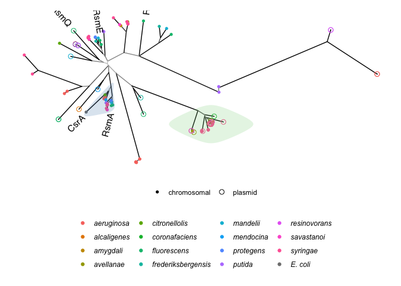
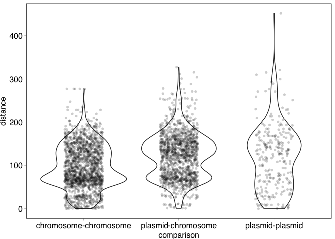

Part 2: Phylogenetic analyses of plasmid-borne RsmA
================
jpjh
Nov 2021

### 2.1 Identification of chromosomal RsmA homologues from genomes with plasmid RsmA genes

Use eFetch to get the full fasta files for all of the sequences matching
the Accession numbers.

Note: this will certainly lead to some redundant duplicates, but these
will be sifted out later.

Note: getting FASTA files so I can run through PROKKA to ensure that
chromosomal RsmA homologues are identified with the same sensitivity as
plasmid homologues.

``` bash
mkdir ./seqs_collected

cat ./working_1/plasmid_csra_accessions.txt | while read ID
do
mkdir ./seqs_collected/$ID
BIOSAMPLE=`curl "https://eutils.ncbi.nlm.nih.gov/entrez/eutils/elink.fcgi?dbfrom=nucleotide&amp;db=biosample&amp;id=${ID}" \
  | xmllint --xpath "//eLinkResult/LinkSet/LinkSetDb/Link/Id/text()" -`
curl "https://eutils.ncbi.nlm.nih.gov/entrez/eutils/elink.fcgi?dbfrom=biosample&amp;db=nucleotide&amp;id=${BIOSAMPLE}" \
  | xml fo -D \
  | xml sel -T -t -v "//eLinkResult/LinkSet/LinkSetDb/Link/Id/text()" -n \
  > seqs.tmp
  cat seqs.tmp | while read seqid
  do
  curl "https://eutils.ncbi.nlm.nih.gov/entrez/eutils/efetch.fcgi?db=nucleotide&amp;id=${seqid}&amp;rettype=fasta&amp;retmode=txt" > ./seqs_collected/${ID}/${seqid}.fasta
  done
done
```

Annotate all of the downloaded files to ensure that annotation is
consistent with the COMPASS annotation.

``` bash
# within prokka_env, running PROKKA 1.14.6

find ./seqs_collected -name "*.fasta" > ./working_2/seqs_collected.txt

cat ./working_2/seqs_collected.txt | while read SEQ
do
base="${SEQ%.*}"
locuscode=`basename $base`
prokka --outdir prokka_tmp \
  --prefix tmp \
  --locustag $locuscode \
  $SEQ
cp ./prokka_tmp/tmp.gff $base.gff
cp ./prokka_tmp/tmp.gbk $base.gbk
cp ./prokka_tmp/tmp.ffn $base.ffn
rm -rf ./prokka_tmp
done

# tar -zcvf seqs_collected_annot.tar.gz seqs_collected/
# scp jamesh@server:/path_to_file/seqs_collected_annot.tar.gz seqs_collected_annot.tar.gz
# tar xvjf seqs_collected_annot.tar.gz
```

Note: some sequences don’t have biolink information. In some cases this
is because the sequence only has a plasmid. In other cases it is because
the sequence was removed from RefSeq.

Investigate manually:

``` bash
find ./seqs_collected -name ".fasta" # gives 6 sequences
```

-   AM235768.1 is pQBR103 (exogenously isolated)
-   NZ_CP018784.1 RefSeq removed: genome length too large
-   NZ_CP027478.1 RefSeq removed: contaminated, genome length too large
-   NZ_CP013824.1 RefSeq removed: many frameshifted proteins
-   NZ_CP025492.1 Sequence has been updated
-   NZ_CP021016.1 Sequence has been updated

Get the updated sequences, and annotate.

``` bash
for ID in NZ_CP025492.2 NZ_CP021016.2; do
mkdir ./seqs_collected/$ID
BIOSAMPLE=`curl "https://eutils.ncbi.nlm.nih.gov/entrez/eutils/elink.fcgi?dbfrom=nucleotide&amp;db=biosample&amp;id=${ID}" \
  | xmllint --xpath "//eLinkResult/LinkSet/LinkSetDb/Link/Id/text()" -`
curl "https://eutils.ncbi.nlm.nih.gov/entrez/eutils/elink.fcgi?dbfrom=biosample&amp;db=nucleotide&amp;id=${BIOSAMPLE}" \
  | xmlstarlet fo -D \
  | xmlstarlet sel -T -t -v "//eLinkResult/LinkSet/LinkSetDb/Link/Id/text()" -n \
  > seqs.tmp
  cat seqs.tmp | while read seqid
  do
  curl "https://eutils.ncbi.nlm.nih.gov/entrez/eutils/efetch.fcgi?db=nucleotide&amp;id=${seqid}&amp;rettype=fasta&amp;retmode=txt" > ./seqs_collected/${ID}/${seqid}.fasta
  echo ./seqs_collected/${ID}/${seqid}.fasta >> ./working_2/seqs_collected_updated.txt
  done
done

cat ./working_2/seqs_collected_updated.txt | while read SEQ
do
base="${SEQ%.*}"
locuscode=`basename $base`
prokka --outdir prokka_tmp \
  --prefix tmp \
  --locustag $locuscode \
  $SEQ
cp ./prokka_tmp/tmp.gff $base.gff
cp ./prokka_tmp/tmp.gbk $base.gbk
cp ./prokka_tmp/tmp.ffn $base.ffn
rm -rf ./prokka_tmp
done

# remove unidentified sequences

mv ./seqs_collected/AM235768.1 ./working_2/seqs_removed
mv ./seqs_collected/NZ_CP018784.1 ./working_2/seqs_removed
mv ./seqs_collected/NZ_CP027478.1 ./working_2/seqs_removed
mv ./seqs_collected/NZ_CP013824.1 ./working_2/seqs_removed
mv ./seqs_collected/NZ_CP025492.1 ./working_2/seqs_removed
mv ./seqs_collected/NZ_CP021016.1 ./working_2/seqs_removed
```

Note: there are certainly duplicates in here, because NCBI has added all
of the files as both BCT (bacteria) and CON (contig).

I’ll deal with this once the sequences have been extracted, by
identifying identical sequences within projects. I’ll also attempt to
identify sequences with less than some threshold divergence, to avoid
the problem of multiple sampling.

Also download and annotate key plasmid-free strains, in the same manner.

These include:

-   *P. protegens* CHA0: LS999205
-   *P. fluorescens* Pf0-1: CP000094
-   *P. protegenes* Pf-5: CP000076
-   *P. fluorescens* SBW25: AM181176
-   *P. putida* KT2440: AE015451
-   *P. aeruginosa* PAO1: AE004091
-   *P. aeruginosa* PA14: CP000438

``` bash
mkdir -p ./seqs_chr/fasta

for ACC in LS999205 CP000094 CP000076 AM181176 AE015451 AE004091 CP000438; do
curl "https://eutils.ncbi.nlm.nih.gov/entrez/eutils/efetch.fcgi?db=nucleotide&amp;id=${ACC}&amp;rettype=fasta&amp;retmode=txt" > ./seqs_chr/fasta/${ACC}.fasta
prokka --outdir ./seqs_chr/${ACC} \
  --prefix $ACC \
  --locustag $ACC \
  ./seqs_chr/fasta/${ACC}.fasta
done
```

Get all genes matching ‘\[Cc\]srA’ from the PROKKA-annotated plasmid and
associated sequences. The second `awk` is to convert multi-line FASTA to
single line.

``` bash
find ./seqs_c* -name "*.ffn" | while read SEQ
do
awk -v RS=">" -v FS='\n' '$1 ~ /([Cc]srA)|([Cc]arbon storage regulator)/ {print RS $0}' ${SEQ} \
  | awk '/^>/ {print s ? s "\n" $0 : $0; s=""; next} {s=s sprintf("%s", $0)} END {if (s) print s}' \
  | tr '\n' '\t' | tr '>' '\n'
done > ./working_2/COMPASS_chr_CsrA_matches_na.tsv

cat ./working_2/COMPASS_chr_CsrA_matches_na.tsv | wc -l #738

find ./seqs_c* -name "*.gff" | while read SEQ
do
grep "[Cc]srA" ${SEQ}
done > ./working_2/COMPASS_chr_CsrA_matches.gff

cat ./working_2/COMPASS_chr_CsrA_matches.gff | wc -l #738
```

Create a file to match up the sequence names with the ‘projects’
(i.e. corresponding COMPASS-database plasmids) they came from.

``` bash
find ./seqs_c* -name "*.fasta" -exec grep -H "^>" {} \; \
  | sed $'s/:>/\t>/g' \
  > ./working_2/seqs_headers.txt
  
cat ./working_2/seqs_headers.txt | wc -l #971
```

Load into R and match up the sequences, with the details from the gff
file, and the sequence headers (which include clue as to whether the
sequence is chromosomal or plasmid).

Sequence headers first. Use `str_detect` to test if the sequence
includes the word “chromosome” or “plasmid”.

``` r
seqids <- read.table("./working_2/seqs_headers.txt", header=FALSE, sep="\t", col.names=c("file","description")) %>%
  separate(file, sep="/", into=c(NA,NA,"project","fasta"), remove=FALSE) %>%
  mutate(pla_chr = ifelse(str_detect(description, "[Cc]hromosome"), "chr",
                   ifelse(str_detect(description, "[Pp]lasmid"), "pla","unk")),
         description = sub(".*? ", "", description),
         file_id = sub(".fasta", "", fasta)) %>%
  unique()

nrow(seqids) # 971 rows
```

    ## [1] 971

Next the GFF files, to get info for where in the sequence the CsrA gene
is found.

``` r
source("./func/gff_functions.R")

gffdetails <- gffRead("./working_2/COMPASS_chr_CsrA_matches.gff")
```

    ## Reading ./working_2/COMPASS_chr_CsrA_matches.gff: found 738 rows with classes: character, character, character, integer, integer, character, character, character, character

``` r
gffids <- data.frame(start     = gffdetails$start,
             end       = gffdetails$end,
             strand    = gffdetails$strand,
             ID = getAttributeField(gffdetails$attributes, "ID")) %>%
  separate(ID, into = c("file_id","orf"), remove=FALSE) %>%
  unique()

nrow(gffids) # 674
```

    ## [1] 674

Next, COMPASS data, which includes phylogeny.

``` r
comp <- read_rds("./working_1/comp.rds") %>%
  select(Accession, Phylum, Class, Order, Family, Genus, Species, Strain) %>%
  rename(project=Accession)
```

Then the NA sequences. Pull all into a single dataframe.

``` r
csra_seqs <- read.table("./working_2/COMPASS_chr_CsrA_matches_na.tsv", header=FALSE, sep="\t", col.names=c("header","seq_na","V3"),
                        blank.lines.skip=TRUE) %>%
  select(-V3) %>% separate(header, sep="[ _]", into=c("file_id","orf"), extra="drop", remove=TRUE) %>%
  left_join(seqids) %>% select(project, file_id, description, orf, pla_chr, seq_na) %>%
  left_join(gffids) %>% left_join(comp) %>%
  arrange(project, file_id, start) %>%
  mutate(proj_start_end = paste(project, start, end, strand, sep="."),
         file_start_end = paste(file_id, start, end, strand, sep="."),
         keep = ifelse(duplicated(proj_start_end, fromLast=TRUE) | duplicated(file_start_end, fromLast=TRUE), "N", "Y")) %>% 
  select(project, Phylum, Class, Order, Family, Genus, Species, Strain, ID, 
         description, file_id, orf, start, end, strand, pla_chr, keep, seq_na)
```

    ## Joining, by = "file_id"
    ## Joining, by = c("file_id", "orf")
    ## Joining, by = "project"

Next steps: pull together into the huge table, which will include
phylogeny details. Just looking at the top rows suggests I may need to
do this semi-manually…

``` r
write.table(csra_seqs, file="./working_2/COMPASS_CsrA_matches_details.tsv", sep="\t",
            row.names=FALSE, quote=FALSE)
```

Examined all, and double-checked the source of those genes annotated
`unk` and determined whether they are indeed chromosomal. Did some
additional editing at this stage to ensure I had the sequences required.

``` r
csra <- read.table("./working_2/COMPASS_CsrA_matches_details_edit.tsv", sep="\t",
            header=TRUE) %>% filter(keep_ == "Y") %>% select(-pla_chr, -keep)

tots <- csra %>% count(project, Genus, Species, name="total")

tots %>% count(Genus, name="num_strains") 
```

    ##              Genus num_strains
    ## 1         Ahniella           1
    ## 2      Alteromonas           3
    ## 3     Arthrobacter           1
    ## 4         Bacillus           1
    ## 5      Halioglobus           1
    ## 6       Isosphaera           1
    ## 7       Legionella          20
    ## 8     Methylophaga           1
    ## 9  Piscirickettsia          11
    ## 10    Planctopirus           1
    ## 11     Pseudomonas          43
    ## 12 Thermomicrobium           1
    ## 13          Vibrio           1
    ## 14     Xanthomonas           9

``` r
# Some strains in the joy plot are not here. Which?
# compass_subset_fam %>% filter(encodes_csra=="Y" & !(Accession %in% tots$project))
```

Recall:

-   AM235768.1 is pQBR103 (exogenously isolated)
-   NZ_CP018784.1 RefSeq removed: genome length too large
-   NZ_CP027478.1 RefSeq removed: contaminated, genome length too large
-   NZ_CP013824.1 RefSeq removed: many frameshifted proteins
-   NZ_CP025492.1 Sequence has been updated
-   NZ_CP021016.1 Sequence has been updated

This leaves 5 sequences.

-   CP027167.1 - This genome has two plasmids with CsrA on, so the whole
    genome was represented, so this genome is under another ‘project’
    CP027170.1
-   NZ_CP019872.1 - This genome has two plasmids with CsrA on, so the
    whole genome was represented, so this genome is under another
    ‘project’ NZ_CP019874.1
-   NZ_CP021284.1 - This genome has two plasmids with CsrA on, so the
    whole genome was represented, so this genome is under another
    ‘project’ NZ_CP021285.1
-   NZ_CP021974.1 - This genome has two plasmids with CsrA on, so the
    whole genome was represented, so this genome is under another
    ‘project’ NZ_CP021975.1
-   NZ_CP026563.1 - This genome has two plasmids with CsrA on, so the
    whole genome was represented, so this genome is under another
    ‘project’ NZ_CP026564.1

``` r
### How many strains without corresponding chromosome csrA genes?

(no_chr_csra <- csra %>% group_by(project, Genus, Species, Strain) %>% 
  summarise(pla_count = sum(pla_chr_=="pla"),
            chr_count = sum(pla_chr_=="chr")) %>%
  filter(chr_count == 0 | pla_count == 0)) %>% 
  group_by(Genus) %>% count()
```

    ## `summarise()` has grouped output by 'project', 'Genus', 'Species'. You can
    ## override using the `.groups` argument.

    ## # A tibble: 4 × 2
    ## # Groups:   Genus [4]
    ##   Genus               n
    ##   <chr>           <int>
    ## 1 Arthrobacter        1
    ## 2 Pseudomonas        21
    ## 3 Thermomicrobium     1
    ## 4 Xanthomonas         1

``` r
# A few of these... Investiagting a subset shows that this is because there is no obviously linked chromosomal sequence on NCBI. 

# Plot! Just plot those strains that have both chromosomal and plasmid-borne csrA genes.

csra_tot_plot <- csra %>% filter(!(project %in% no_chr_csra$project)) %>%
  count(Genus, Species, Strain, pla_chr_, name="count") %>%
  mutate(Name = paste(Species, Strain), 
         Filltype = factor(case_when(Genus == "Pseudomonas" ~ "Pseudomonas",
                                     Genus == "Legionella" ~ "Legionella",
                                     TRUE ~ "Other"), levels=c("Pseudomonas","Legionella","Other")))

(plot_chr_plasmid_csra <- ggplot(data=csra_tot_plot, aes(x=fct_reorder(Name, count), 
                                                        y=count, alpha=pla_chr_, fill=Filltype)) +
    geom_bar(stat="identity") + scale_alpha_manual(values=c(1,0.5), name="Location") +
    scale_fill_brewer(type="qual", palette=6, name="Genus") +
    scale_y_continuous(breaks=0:9) + labs(x="Strain name", y="# CsrA genes") +
    theme(axis.text.x=element_text(angle=45, hjust=1), legend.position="bottom")) 
```

<!-- -->

``` r
png(filename="./figs/2_1_PlaChr.png", height=5, width=7.2, units="in", res=300)
plot_chr_plasmid_csra + theme_pub() +
  theme(axis.text.x=element_text(angle=60, hjust=1, vjust=1), legend.position="bottom", plot.margin = margin(0,0,0,0.5, "in"))
dev.off()
```

    ## quartz_off_screen 
    ##                 2

### 2.2 Tree of CsrA/RsmA homologues in *Pseudomonas*

First investigate Pseudomonas. Output the FASTA-formatted files for all
Pseudomonas, with ID for the header (file_orf).

``` r
outseqs <- csra %>% filter(Genus == "Pseudomonas") %>%
  select(ID, seq_na) %>% mutate(h = paste(">", ID, sep=""),
                                outseq = paste(h, seq_na, sep="\n")) %>%
  select(outseq)

write.table(outseqs, file="./working_2/aln/csrA_Pseudomonas.fasta", row.names=FALSE, quote=FALSE, col.names=FALSE)
```

Approach:

-   Do trees with everything to examine and find duplicates
-   Do trees with deduplicated sequences
-   Do trees with conserved positions only to avoid problems with a
    gappy alignment

Add in the pQBR103 sequence, and the *E. coli* outgroup, and align.

``` bash
cat ./working_2/aln/csrA_Pseudomonas.fasta ./ref/pQBR0443.fasta ./ref/csra_eco.fasta \
  > ./working_2/aln/csrA_Pseudomonas_.fasta
```

Did a rough alignment in Aliview using MUSCLE. This enabled me to see
areas with misannotated start sites. Cleared these up manually, by
deleting parts of the sequence before the canonical start codon for:

-   71725141_00007
-   71725141_00080
-   1352817906_03961

Also edited the names of the sequences from pQBR103 and E. coli to
ensure there is only one underscore, to facilitate matching later.

Saved as `./working_2/aln/csrA_Pseudomonas_edit.fasta`. Perform codon
alignment in PRANK (v.170427), examine, and make a tree with raxML.

``` bash
prank -d=./working_2/aln/csrA_Pseudomonas_edit.fasta \
  -o=./working_2/aln/csrA_Pseudomonas_edit.aln -showall -codon -F
  
cp ./working_2/aln/csrA_Pseudomonas_edit.aln.best.fas ./working_2/aln/csrA_Pseudomonas_edit.aln.fasta

# scp ./working_2/aln/csrA_Pseudomonas_edit.aln.fasta jamesh@server:/path_to_file/csrA_Pseudomonas_edit.aln.fasta
# on the server  

raxmlHPC -f a -m GTRCAT -p 12345 -x 12345 -# 100 -s csrA_Pseudomonas_edit.aln.fasta -n PsT1 
raxmlHPC -f b -m GTRCAT -n PsT1.tre -t RAxML_bestTree.PsT1 -z RAxML_bootstrap.PsT1

# Found 66 sequences that are exactly identical to other sequences in the alignment.

# scp jamesh@server:/path_to_file/*.PsT1 ./trees/pseudomonas
```

Good start. Examining this tree in Figtree identifies a number of
duplicates, and some poor bootstrap support for some of the groups.

Remove exact duplicates, and realign.

``` r
nrow(outseqs)
```

    ## [1] 144

``` r
(ps_nodups <- csra %>% filter(Genus == "Pseudomonas") %>%
  group_by(pla_chr_) %>%
  mutate(duplicated_seq = duplicated(seq_na)) %>% 
  filter(duplicated_seq==FALSE)) %>% nrow()
```

    ## [1] 78

144 *Pseudomonas* sequences total, 78 once duplicates were removed.

``` r
csra %>% filter(Genus == "Pseudomonas") %>% 
  group_by(pla_chr_) %>% filter(!duplicated(seq_na)) %>% nrow() # 78 seqs
```

    ## [1] 78

``` r
csra %>% filter(Genus == "Pseudomonas") %>% 
  filter(!duplicated(seq_na)) %>% nrow() # 78 seqs -- no effect of grouping by plasmid/chromosome
```

    ## [1] 78

``` r
csra %>% filter(Genus == "Pseudomonas") %>% 
  group_by(Species) %>%
  filter(!duplicated(seq_na)) %>% nrow() # 87 seqs -- 
```

    ## [1] 87

``` r
#  grouping by species reduces the number of duplicates, thus there are duplicates across species
```

No sequences were identical across replicon types. Some sequences were
identical across species.

``` r
outseqs_ps_nodups <- ps_nodups %>% ungroup() %>%
  select(ID, seq_na) %>% mutate(h = paste(">", ID, sep=""),
                                           outseq = paste(h, seq_na, sep="\n")) %>%
  select(outseq)

write.table(outseqs_ps_nodups, file="./working_2/aln/csrA_Pseudomonas_nodups.fasta", row.names=FALSE, quote=FALSE, col.names=FALSE)
```

Add in the additional sequences and align.

``` bash
cat ./working_2/aln/csrA_Pseudomonas_nodups.fasta ./ref/pQBR0443.fasta ./ref/csra_eco.fasta \
  > ./working_2/aln/csrA_Pseudomonas_nodups_.fasta
```

Align.

``` bash
prank -d=./working_2/aln/csrA_Pseudomonas_nodups_edit.fasta \
  -o=./working_2/aln/csrA_Pseudomonas_nodups_edit.aln -showall -codon -F
  
cp ./working_2/aln/csrA_Pseudomonas_nodups_edit.aln.best.fas ./working_2/aln/csrA_Pseudomonas_nodups_edit.aln.fasta
```

Build tree.

``` bash
# scp ./working_2/aln/csrA_Pseudomonas_nodups_edit.aln.fasta jamesh@server:/path_to_file/csrA_Pseudomonas_nodups_edit.aln.fasta

raxmlHPC -f a -m GTRCAT -p 12345 -x 12345 -# 100 -s csrA_Pseudomonas_nodups_edit.aln.fasta -n PsT2

raxmlHPC -f b -m GTRCAT -n PsT2.tre -t RAxML_bestTree.PsT2 -z RAxML_bootstrap.PsT2

# scp jamesh@server:/path_to_file/*.PsT2 ./trees/pseudomonas
```

Various trees examined in Figtree. Use `ggtree` to generate an annotated
figure of the full tree, and with duplicates removed.

``` r
# Create labels

labels_ps <- csra %>% filter(Genus == "Pseudomonas") %>%
  select(ID, Species, Strain, pla_chr_) %>%
  mutate(label=ID, location=pla_chr_,
         spc=sapply(strsplit(Species, " "),
                        `[`, 2)) %>%
  select(label, spc, Strain, location)

spc_order <- sort(unique(labels_ps$spc))

labels_ps <- labels_ps %>% bind_rows(
  data.frame(label=c("NC000913_CsrA","AM235768_pQBR0443"),
             spc=c("E. coli","fluorescens"),
             Strain=c("MG1655","pQBR103"),
             location=c("chr","pla"))) %>%
  mutate(species = factor(spc, levels=c(spc_order, "E. coli"))) %>%
  select(-spc)

highlights_ps <- data.frame(
  label=c("AM181176_04128","AM181176_04293","AM181176_04705",
          "AM235768_pQBR0443","NC000913_CsrA"),
  text= c("RsmE","RsmI","RsmA",
          "RsmQ","CsrA")
)

labels_ps <- labels_ps %>% left_join(highlights_ps, by="label", all=TRUE)
```

Key trees to plot:

-   PsT1: overview of Pseudomonas plasmid CsrA diversity
-   PsT2: as PsT1 but with duplicates removed.

``` r
library(treeio)
```

    ## treeio v1.18.1  For help: https://yulab-smu.top/treedata-book/
    ## 
    ## If you use treeio in published research, please cite:
    ## 
    ## LG Wang, TTY Lam, S Xu, Z Dai, L Zhou, T Feng, P Guo, CW Dunn, BR Jones, T Bradley, H Zhu, Y Guan, Y Jiang, G Yu. treeio: an R package for phylogenetic tree input and output with richly annotated and associated data. Molecular Biology and Evolution 2020, 37(2):599-603. doi: 10.1093/molbev/msz240

``` r
library(ggtree)
```

    ## ggtree v3.2.1  For help: https://yulab-smu.top/treedata-book/
    ## 
    ## If you use ggtree in published research, please cite the most appropriate paper(s):
    ## 
    ## 1. Guangchuang Yu. Using ggtree to visualize data on tree-like structures. Current Protocols in Bioinformatics. 2020, 69:e96. doi:10.1002/cpbi.96
    ## 2. Guangchuang Yu, Tommy Tsan-Yuk Lam, Huachen Zhu, Yi Guan. Two methods for mapping and visualizing associated data on phylogeny using ggtree. Molecular Biology and Evolution. 2018, 35(12):3041-3043. doi:10.1093/molbev/msy194
    ## 3. Guangchuang Yu, David Smith, Huachen Zhu, Yi Guan, Tommy Tsan-Yuk Lam. ggtree: an R package for visualization and annotation of phylogenetic trees with their covariates and other associated data. Methods in Ecology and Evolution. 2017, 8(1):28-36. doi:10.1111/2041-210X.12628

    ## 
    ## Attaching package: 'ggtree'

    ## The following object is masked from 'package:tidyr':
    ## 
    ##     expand

``` r
library(scales)
```

    ## 
    ## Attaching package: 'scales'

    ## The following object is masked from 'package:purrr':
    ## 
    ##     discard

    ## The following object is masked from 'package:readr':
    ## 
    ##     col_factor

``` r
library(ggnewscale)

pst1 <- read.raxml("trees/pseudomonas/RAxML_bipartitionsBranchLabels.PsT1")

labels_pst1 <- filter(labels_ps, label %in% pst1@phylo$tip.label)

(tree_ps <- ggtree(pst1, layout="daylight", aes(colour=bootstrap)) %<+% 
    labels_pst1 +
    scale_colour_gradientn(
      colours=c("grey80","grey80","grey60","grey60","grey40","black"), 
      na.value="black", guide="none") +
    new_scale("colour") +
    geom_tippoint(aes(shape=location, size=location, colour=species)) +
    scale_colour_manual(values=c(hue_pal()(length(spc_order)), "grey50"),
                        guide=guide_legend(label.theme=element_text(angle = 0, size=9, face = "italic")),
                        name="") +
    geom_hilight(node=203, fill="steelblue", alpha=0.2, size=0, expand=0.02) +
    geom_hilight(node=113, fill="palegreen3", alpha=0.2, size=0, expand=0.02) +
    geom_tiplab(aes(label=text), show.legend=FALSE, hjust=-0.3, size=4) +
    scale_shape_manual(values=c(16,1), breaks=c("chr","pla"), 
                       labels=c("chromosomal","plasmid"), name="") +
    scale_size_manual(values=c(1.5,2.5), breaks=c("chr","pla"), 
                       labels=c("chromosomal","plasmid"), name="") +
    theme(legend.position="bottom", legend.box="vertical", legend.direction="horizontal"))
```

    ## Average angle change [1] 0.192816405435805

    ## Average angle change [2] 0.0655594023602957

    ## Average angle change [3] 0.0267881111331094

<!-- -->

``` r
png(filename="./figs/2_2_Ps_tree_1.png", height=5, width=7, units="in", res=600)
tree_ps + vexpand(0.4, direction=1)
dev.off()
```

    ## quartz_off_screen 
    ##                 2

``` r
svglite::svglite("./figs/2_2_Ps_tree_1.svg", height=5, width=7)
tree_ps + vexpand(0.4, direction=1)
dev.off()
```

    ## quartz_off_screen 
    ##                 2

Plot PsT2, to see if patterns change with duplicates removed.

``` r
plot_rsm_ps_tree <- function(x, labels=labels_ps) {
  tree <- read.raxml(x)
  labs_tree <- filter(labels, label %in% tree@phylo$tip.label)
  treeplot <- ggtree(tree, layout="daylight", aes(colour=bootstrap)) %<+% 
    labs_tree +
    scale_colour_gradientn(
      colours=c("grey80","grey80","grey60","grey60","grey40","black"), 
      na.value="black", guide = "none") +
    new_scale("colour") +
    geom_tippoint(aes(shape=location, size=location, colour=species)) +
    scale_colour_manual(values=c(hue_pal()(length(spc_order)), "grey50")) +
    geom_tiplab(aes(label=text), show.legend=FALSE, hjust=-0.3, size=3) +
    scale_shape_manual(values=c(16,1)) +
    scale_size_manual(values=c(1.5,2.5)) +
    theme(legend.text=element_text(face="italic"))
  return(treeplot)
}

tree_ps_nodup <- plot_rsm_ps_tree("trees/pseudomonas/RAxML_bipartitionsBranchLabels.PsT2") +
    geom_hilight(node=138, fill="steelblue", alpha=0.2, size=0, expand=0.02) +
    geom_hilight(node=116, fill="palegreen3", alpha=0.2, size=0, expand=0.02)
```

    ## Average angle change [1] 0.178131083155362

    ## Average angle change [2] 0.0600965506970243

    ## Average angle change [3] 0.0324692016994295

Other trees were generated to understand the contribution of alignment
gaps (not shown). Overall the conclusions that can be drawn from these
analyses are robust to the decisions made in presenting the tree.

Calculate the distance matrix and test to see whether plasmid-chromosome
distances are larger than chromosome-chromosome. Calculating using
Jukes-Cantor and Jin-Nei Gamma distances.

``` bash
# PsT1
distmat -sequence ./working_2/aln/csrA_Pseudomonas_edit.aln.fasta \
  -nucmethod 1 \
  -outfile ./working_2/aln/PsT1.jc.distmat
  
distmat -sequence ./working_2/aln/csrA_Pseudomonas_edit.aln.fasta \
  -nucmethod 5 \
  -outfile ./working_2/aln/PsT1.jng.distmat
  
# PsT2
distmat -sequence ./working_2/aln/csrA_Pseudomonas_nodups_edit.aln.fasta \
  -nucmethod 1 \
  -outfile ./working_2/aln/PsT2.jc.distmat
  
distmat -sequence ./working_2/aln/csrA_Pseudomonas_nodups_edit.aln.fasta \
  -nucmethod 5 \
  -outfile ./working_2/aln/PsT2.jng.distmat
```

Load into R, plot, and analyse.

Test distances for each alignment made, to ensure robustness of
findings.

``` r
source("./func/read_phylip_distmat.r")

pla_seqs <- filter(csra, pla_chr_ == "pla") %>% select(ID) %>% pull()
chr_seqs <- filter(csra, pla_chr_ == "chr") %>% select(ID) %>% pull()

chr_seqs <- c(chr_seqs, "NC000913_CsrA")
pla_seqs <- c(pla_seqs, "AM235768_pQBR0443")

analyse_distmat <- function(x) {
  distmat <- read_phylip_distmat(x) %>%
  mutate(comparison = case_when((sequence_1 %in% pla_seqs) & (sequence_2 %in% pla_seqs) ~ "plasmid-plasmid",
                                (sequence_1 %in% pla_seqs) & (sequence_2 %in% chr_seqs) ~ "plasmid-chromosome",
                                (sequence_1 %in% chr_seqs) & (sequence_2 %in% pla_seqs) ~ "plasmid-chromosome",
                                (sequence_1 %in% chr_seqs) & (sequence_2 %in% chr_seqs) ~ "chromosome-chromosome")) %>%
  filter(!(sequence_1==sequence_2))
  print(ggplot(data=distmat, aes(x=comparison, y=distance)) + 
    geom_violin() + 
    geom_point(position=position_jitter(width=0.2), alpha=0.2, shape=16))
  
  test1 <- wilcox.test(distance ~ comparison, subset(distmat, 
                                                     comparison %in% c("chromosome-chromosome", "plasmid-chromosome")))
  test2 <- wilcox.test(distance ~ comparison, subset(distmat,
                                                     comparison %in% c("chromosome-chromosome", "plasmid-plasmid")))
  test3 <- wilcox.test(distance ~ comparison, subset(distmat, 
                                                     comparison %in% c("plasmid-chromosome", "plasmid-plasmid")))
  df <- data.frame(group1 = c("chromosome-chromosome", "chromosome-chromosome", "plasmid-chromosome"),
             group2 = c("plasmid-chromosome","plasmid-plasmid","plasmid-plasmid"),
             wilcox_test = c(test1$p.value, test2$p.value, test3$p.value)) %>%
    mutate(p.adj = p.adjust(wilcox_test, method="bonferroni"))
  return(df)
}

(pst1_test_jc <- analyse_distmat("./working_2/aln/pst1.jc.distmat")) %>% kable()
```

    ## Rows: 146 Columns: 149
    ## ── Column specification ────────────────────────────────────────────────────────
    ## Delimiter: "\t"
    ## chr   (1): X149
    ## dbl (146): X2, X3, X4, X5, X6, X7, X8, X9, X10, X11, X12, X13, X14, X15, X16...
    ## lgl   (2): X1, X148
    ## 
    ## ℹ Use `spec()` to retrieve the full column specification for this data.
    ## ℹ Specify the column types or set `show_col_types = FALSE` to quiet this message.

<!-- -->

| group1                | group2             | wilcox_test |     p.adj |
|:----------------------|:-------------------|------------:|----------:|
| chromosome-chromosome | plasmid-chromosome |   0.0000000 | 0.0000000 |
| chromosome-chromosome | plasmid-plasmid    |   0.0000000 | 0.0000000 |
| plasmid-chromosome    | plasmid-plasmid    |   0.3227554 | 0.9682663 |

``` r
(pst1_test_jng <- analyse_distmat("./working_2/aln/pst1.jng.distmat")) %>% kable()
```

    ## Rows: 146 Columns: 149
    ## ── Column specification ────────────────────────────────────────────────────────
    ## Delimiter: "\t"
    ## chr   (1): X149
    ## dbl (146): X2, X3, X4, X5, X6, X7, X8, X9, X10, X11, X12, X13, X14, X15, X16...
    ## lgl   (2): X1, X148
    ## 
    ## ℹ Use `spec()` to retrieve the full column specification for this data.
    ## ℹ Specify the column types or set `show_col_types = FALSE` to quiet this message.

<!-- -->

| group1                | group2             | wilcox_test |     p.adj |
|:----------------------|:-------------------|------------:|----------:|
| chromosome-chromosome | plasmid-chromosome |   0.0000000 | 0.0000000 |
| chromosome-chromosome | plasmid-plasmid    |   0.0000000 | 0.0000000 |
| plasmid-chromosome    | plasmid-plasmid    |   0.2949414 | 0.8848241 |

``` r
(pst2_test_jc <- analyse_distmat("./working_2/aln/pst2.jc.distmat")) %>% kable()
```

    ## Rows: 80 Columns: 83
    ## ── Column specification ────────────────────────────────────────────────────────
    ## Delimiter: "\t"
    ## chr  (1): X83
    ## dbl (80): X2, X3, X4, X5, X6, X7, X8, X9, X10, X11, X12, X13, X14, X15, X16,...
    ## lgl  (2): X1, X82
    ## 
    ## ℹ Use `spec()` to retrieve the full column specification for this data.
    ## ℹ Specify the column types or set `show_col_types = FALSE` to quiet this message.

<!-- -->

| group1                | group2             | wilcox_test |   p.adj |
|:----------------------|:-------------------|------------:|--------:|
| chromosome-chromosome | plasmid-chromosome |   0.0000000 | 0.0e+00 |
| chromosome-chromosome | plasmid-plasmid    |   0.0000013 | 3.8e-06 |
| plasmid-chromosome    | plasmid-plasmid    |   0.3693582 | 1.0e+00 |

``` r
(pst2_test_jng <- analyse_distmat("./working_2/aln/pst2.jng.distmat")) %>% kable()
```

    ## Rows: 80 Columns: 83
    ## ── Column specification ────────────────────────────────────────────────────────
    ## Delimiter: "\t"
    ## chr  (1): X83
    ## dbl (80): X2, X3, X4, X5, X6, X7, X8, X9, X10, X11, X12, X13, X14, X15, X16,...
    ## lgl  (2): X1, X82
    ## 
    ## ℹ Use `spec()` to retrieve the full column specification for this data.
    ## ℹ Specify the column types or set `show_col_types = FALSE` to quiet this message.

<!-- -->

| group1                | group2             | wilcox_test |   p.adj |
|:----------------------|:-------------------|------------:|--------:|
| chromosome-chromosome | plasmid-chromosome |   0.0000000 | 0.0e+00 |
| chromosome-chromosome | plasmid-plasmid    |   0.0000019 | 5.6e-06 |
| plasmid-chromosome    | plasmid-plasmid    |   0.3349858 | 1.0e+00 |

Once duplicates are removed, then consistent patterns are seen when
comparing distances between plasmid-encoded and chromosome-encoded
RsmA/CsrA homologues: chromosome-chromosome distances are shorter than
comparisons with plasmids, regardless of whether distances calculated
are Jukes-Cantor, or Jin-Nei Gamma.

### 2.3 Investigating closely-related plasmid and chromosomal copies

Rob mentioned that the cluster of similar plasmid and chromosomal
sequences may represent ICEs. Investigate these, by highlighting the
cluster in Figtree and extracting the sequence names (paste tree in new
document and save).

``` r
(pseudomonas_cluster <- read.table("./working_2/csrA_Pseudomonas_cluster.txt", col.names=c("ID")) %>%
  left_join(csra, by="ID") %>% select(ID,pla_chr_,Species,Strain, start, end)) %>% 
  filter(pla_chr_=="chr") %>% kable()
```

| ID               | pla_chr\_ | Species                | Strain         |   start |     end |
|:-----------------|:----------|:-----------------------|:---------------|--------:|--------:|
| 1069642232_00715 | chr       | Pseudomonas syringae   | ICMP 18708     |  733504 |  733740 |
| 1069642232_00750 | chr       | Pseudomonas syringae   | ICMP 18708     |  763168 |  763392 |
| 1069642232_01637 | chr       | Pseudomonas syringae   | ICMP 18708     | 1749897 | 1750121 |
| 1069642234_00716 | chr       | Pseudomonas syringae   | ICMP 18884     |  733502 |  733738 |
| 1069642234_00751 | chr       | Pseudomonas syringae   | ICMP 18884     |  763166 |  763390 |
| 1069642234_01640 | chr       | Pseudomonas syringae   | ICMP 18884     | 1749894 | 1750118 |
| 1124258662_00716 | chr       | Pseudomonas syringae   | NZ-45          |  733502 |  733738 |
| 1124258662_00751 | chr       | Pseudomonas syringae   | NZ-45          |  763166 |  763390 |
| 1124258662_01753 | chr       | Pseudomonas syringae   | NZ-45          | 1850745 | 1850969 |
| 1124259670_00716 | chr       | Pseudomonas syringae   | NZ-47          |  733502 |  733738 |
| 1124259670_00751 | chr       | Pseudomonas syringae   | NZ-47          |  763166 |  763390 |
| 1124259670_01639 | chr       | Pseudomonas syringae   | NZ-47          | 1749894 | 1750118 |
| 1155175691_00716 | chr       | Pseudomonas syringae   | CRAFRU 12.29   |  733501 |  733737 |
| 1155175691_00751 | chr       | Pseudomonas syringae   | CRAFRU 12.29   |  763165 |  763389 |
| 1155175691_01740 | chr       | Pseudomonas syringae   | CRAFRU 12.29   | 1845889 | 1846113 |
| 1155339052_00716 | chr       | Pseudomonas syringae   | CRAFRU 14.08   |  733501 |  733737 |
| 1155339052_00751 | chr       | Pseudomonas syringae   | CRAFRU 14.08   |  763165 |  763389 |
| 1155339052_01740 | chr       | Pseudomonas syringae   | CRAFRU 14.08   | 1844218 | 1844442 |
| 1352817906_00920 | chr       | Pseudomonas amygdali   | R15244         | 1008965 | 1009189 |
| 1352817906_03961 | chr       | Pseudomonas amygdali   | R15244         | 4266445 | 4266708 |
| 1352823967_00904 | chr       | Pseudomonas avellanae  | R2leaf         |  965914 |  966138 |
| 71733195_00798   | chr       | Pseudomonas savastanoi | 1448A; BAA-978 |  895723 |  895947 |

Most of the genes in this cluster are on the chromosome, rather than
plasmid. The chromosomal genes are mainly on six *syringae* strains,
which have identical CsrA/RsmA sequences.

See the article by [Poulter et
al. 2018](https://www.nature.com/articles/s41598-018-29261-5), which
discusses *P. syringae* ICMP18708 (Psa3, closely related to ICMP18884,
see Firraro et al. 2018) in relation to ICMP9853 (Psa1). See also
articles by [Firrao et
al. 2018](https://www.frontiersin.org/articles/10.3389/fmicb.2018.00656/full)
which discusses CRAFRU 12.29 and CRAFRU 14.08 and [Colombi et
al. 2017](https://sfamjournals.onlinelibrary.wiley.com/doi/10.1111/1462-2920.13662).

Psa3 has 7 identified CsrA, six on the chromosome, three of which
cluster with the plasmid gene.

``` r
csra %>% filter(Strain=="ICMP 18708") %>% select(ID, pla_chr_, start, end) %>% 
  mutate(in_cluster = ifelse(ID %in% pseudomonas_cluster$ID, "Y", "")) %>%
  kable() 
```

| ID               | pla_chr\_ |   start |     end | in_cluster |
|:-----------------|:----------|--------:|--------:|:-----------|
| 1069642232_00715 | chr       |  733504 |  733740 | Y          |
| 1069642232_00750 | chr       |  763168 |  763392 | Y          |
| 1069642232_01637 | chr       | 1749897 | 1750121 | Y          |
| 1069642232_01920 | chr       | 2029117 | 2029305 |            |
| 1069642232_02245 | chr       | 2399678 | 2399866 |            |
| 1069642232_04168 | chr       | 4563196 | 4563390 |            |
| 1069642233_00072 | pla       |   66159 |   66383 | Y          |

In contrast, only the plasmid gene is in the cluster for Psa1.

``` r
csra %>% filter(Strain=="ICMP 9853") %>% select(ID, pla_chr_, start, end) %>% 
  mutate(in_cluster = ifelse(ID %in% pseudomonas_cluster$ID, "Y", "")) %>%
  kable() 
```

| ID               | pla_chr\_ |   start |     end | in_cluster |
|:-----------------|:----------|--------:|--------:|:-----------|
| 1143563135_02157 | chr       | 2288684 | 2288872 |            |
| 1143563135_04047 | chr       | 4409618 | 4409806 |            |
| 1143563135_04349 | chr       | 4720263 | 4720457 |            |
| 1143563136_00002 | pla       |     761 |     991 | Y          |

The Japanese strain, ICMP9853 (Psa1), has two simple tRNA-Lys genes
without any ICE or exapt_ICE remnants, whereas Psa3 has an ICE and two
degenerate ICEs (exapt ICE). exapt_ICE-A at 1733936 to 1784329 bp
explains one of the three clustering chromosomal csrA genes
(1069642232_01637).

The role of the other two genes is not clear. Examination of the Psa1
genome suggested that homologues of these genes are present, in slightly
truncated (N-terminal end) form.

The other sequences are from *Pseudomonas amygdali* R15244 and
*Pseudomonas savastanoi* 1448A. The genomes were run through
[MobileElementFinder](https://cge.cbs.dtu.dk/services/MobileElementFinder/)
but there were no transposons associated with the CsrA/RsmA-encoding
regions.

Overall, we can conclude at least some of the annotated ‘chromosomal’
genes in this cluster are likely to be on degenerate ICE.

------------------------------------------------------------------------

**[Back to index.](PLASMAN_index.md)**
