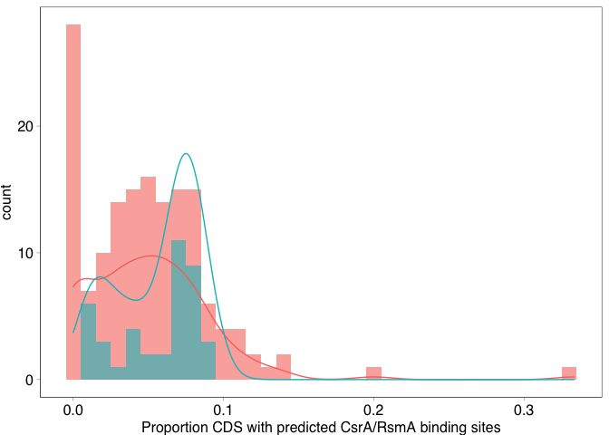
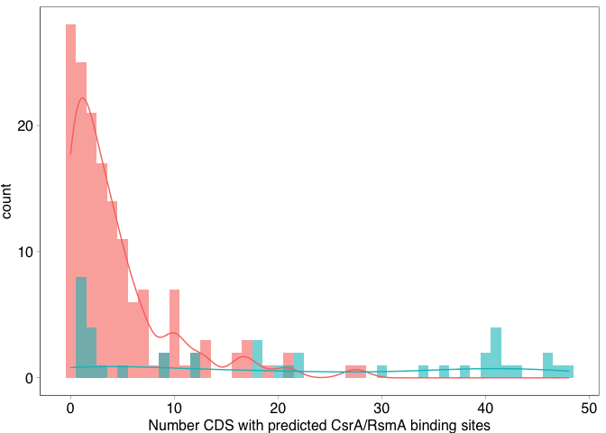

3. Comparison of CsrA/RsmA-binding sites on plasmids
================
jpjh
December 2021

### Prediction of CsrA/RsmA binding sites on *Pseudomonas* plasmids

Script obtained from [Rahul Kulkarni, University of Massachusetts,
Boston](https://www.umb.edu/academics/csm/faculty_staff/rahul_kulkarni),
which was published in Kulkarni PR, Jia T, Kuehne SA, Kerkering TM,
Morris ER, Searle MS, Heeb S, Rao J, Kulkarni RV. 2014 A sequence-based
approach for prediction of CsrA/RsmA targets in bacteria with
experimental validation in Pseudomonas aeruginosa. Nucleic Acids Res.
42, 6811–6825. (doi:
[10.1093/nar/gku309](dx.doi.org/10.1093/nar/gku309)). Some small
alterations were made to the script.

Run against all *Pseudomonas* plasmids from COMPASS, and plot the
distribution of sites for CsrA/RsmA-containing plasmids
vs. non-CsrA/RsmA-containing plasmids.

Requires 200 bp upstream regions and 30 bp into the coding region for
all predicted genes for analysis.

Extract the upstream region from all *Pseudomonas* PROKKA-annotated
COMPASS plasmids using a command like
`find ./ps_plas_gff -name "*.gff" -exec extractfeat -before 200 -after -31 -type CDS -sequence {} -stdout >> ./ref/COMPASS_prokka_ps_upstream.fasta \;`.
Note: extractfeat cannot cope with circular sequences, so the upstream
regions for genes located at the ends of the sequence are lost. However,
this will likely affect both types of plasmids (CsrA/RsmA+/-)
equivalently.

Format the extracted sequences to be acceptable to CSRA_TARGET.

``` bash
cat ./ref/COMPASS_prokka_ps_upstream.fasta \
  | sed 's/ \[CDS\]//g' \
  | awk -v OFS="\t" '{
      if ($1 ~ /^>/) 
      print $1, "100; upstream from -200 to +30; size: 231";
      else 
      print $0
      }' \
  > ./CSRA_TARGET/COMPASS_ps_regions.txt
  
echo "COMPASS_ps" > ./CSRA_TARGET/organisms.txt
  
cd CSRA_TARGET

perl CSRA_TARGET_JH.pl
```

Edited to remove footer.

Get full list of genes for comparison.

``` bash
grep "^>" ./CSRA_TARGET/COMPASS_ps_regions.txt \
  | awk -v FS="\t" '{print $1}' | sed 's/>//g' \
  > ./ref/COMPASS_prokka_ps_genes.txt
```

Load into R.

``` r
# load up full COMPASS database details
comp <- read_rds("./working_1/comp.rds")
dups <- read_rds("./working_1/dups.rds")

compass <- comp %>% filter(!(Accession %in% dups$V1))

plasmid_csra <- read.table("./working_1/plasmid_csra_accessions.txt", header=FALSE,
                           col.names="Accession")

csra_targets <- read.table("./CSRA_TARGET/genenames_COMPASS_ps.txt", header=TRUE, sep="\t", fill=NA) %>%
  filter(!is.na(gene)) %>%
  mutate(Accession = gsub("_[0-9]+_[0-9]+", "", gene),
         start = gsub(".*_([0-9]+)_.*", "\\1", gene),
         end = gsub(".*_([0-9]+)$", "\\1", gene))
  
csra_targets_count <- csra_targets %>% group_by(Accession) %>% summarise(total_csra = n())

cds_csra_count <- read.table("./ref/COMPASS_prokka_ps_genes.txt", header=FALSE, col.names="gene") %>%
    mutate(Accession = gsub("_[0-9]+_[0-9]+", "", gene),
         start = gsub(".*_([0-9]+)_.*", "\\1", gene),
         end = gsub(".*_([0-9]+)$", "\\1", gene)) %>%
  group_by(Accession) %>% summarise(total_cds = n()) %>%
  left_join(csra_targets_count, by = "Accession") %>% 
  left_join(comp, by="Accession") %>%
  mutate(total_csra = ifelse(is.na(total_csra), 0, total_csra),
         duplicated = ifelse(Accession %in% dups$V1, "Y", "N"),
         csra_density_cds = total_csra/total_cds,
         csra_density_bp  = total_csra/Size..bp.,
         encodes_csra = ifelse(Accession %in% plasmid_csra$Accession, "Y", "N"))
```

Plot. Make a label so it includes numbers of each type in the legend.

``` r
cds_csra_count %>% group_by(encodes_csra) %>% summarise(n = n())
```

    ## # A tibble: 2 × 2
    ##   encodes_csra     n
    ##   <chr>        <int>
    ## 1 N              155
    ## 2 Y               41

``` r
cds_csra_count <- cds_csra_count %>% 
  mutate(encodes_csra_label = ifelse(encodes_csra=="Y", "Y (n = 41)", "N (n = 155)"))

(cds_csra_density_plot <- ggplot(cds_csra_count, aes(x=csra_density_cds, 
                                                     fill=encodes_csra_label)) +
  geom_histogram(size=0, alpha=0.6, binwidth=0.01, position="identity") +
  geom_density(size=0.5, fill=NA, aes(colour=encodes_csra_label), show.legend=FALSE) +
  labs(x="Proportion CDS with predicted CsrA/RsmA binding sites",
       fill="encodes CsrA/RsmA?", y="count")) 
```

<!-- -->

``` r
(cds_csra_total_plot <- ggplot(cds_csra_count, aes(x=total_csra, 
                                                     fill=encodes_csra_label)) +
  geom_histogram(size=0, alpha=0.6, binwidth=1, position="identity") +
    geom_density(size=0.5, fill=NA, aes(colour=encodes_csra_label, y=..count..), show.legend=FALSE) +
  labs(x="Number CDS with predicted CsrA/RsmA binding sites",
       fill="encodes CsrA/RsmA?", y="count"))
```

<!-- -->

``` r
library(patchwork())

png(filename="./figs/3_1_csra_site_density.png", height=3, width=4.5, units="in", res=300)
(cds_csra_total_plot + theme_pub()) + 
  (cds_csra_density_plot + theme_pub() + theme(legend.position=c(0.7,0.8))) 
dev.off()
```

    ## quartz_off_screen 
    ##                 2

Test statistically, using the Kolmogorov-Smirnov test.

``` r
cds_csra_densities_csra <- cds_csra_count %>% 
  filter(encodes_csra=="Y") %>% select(csra_density_cds) %>%
  arrange() %>% pull()
  
cds_csra_densities_nocsra <- cds_csra_count %>% 
  filter(encodes_csra=="N") %>% select(csra_density_cds) %>%
  arrange() %>% pull()

ks.test(cds_csra_densities_csra, cds_csra_densities_nocsra) # p = 0.012
```

    ## Warning in ks.test(cds_csra_densities_csra, cds_csra_densities_nocsra): cannot
    ## compute exact p-value with ties

    ## 
    ##  Two-sample Kolmogorov-Smirnov test
    ## 
    ## data:  cds_csra_densities_csra and cds_csra_densities_nocsra
    ## D = 0.28072, p-value = 0.01207
    ## alternative hypothesis: two-sided

``` r
cds_csra_totals_csra <- cds_csra_count %>% 
  filter(encodes_csra=="Y") %>% select(total_csra) %>%
  arrange() %>% pull()
  
cds_csra_totals_nocsra <- cds_csra_count %>% 
  filter(encodes_csra=="N") %>% select(total_csra) %>%
  arrange() %>% pull()

ks.test(cds_csra_totals_csra, cds_csra_totals_nocsra) # p = 2.7e-8
```

    ## Warning in ks.test(cds_csra_totals_csra, cds_csra_totals_nocsra): cannot compute
    ## exact p-value with ties

    ## 
    ##  Two-sample Kolmogorov-Smirnov test
    ## 
    ## data:  cds_csra_totals_csra and cds_csra_totals_nocsra
    ## D = 0.52872, p-value = 2.681e-08
    ## alternative hypothesis: two-sided

Significant difference in the distribution of CsrA sites depending on
whether the plasmid encodes CsrA homologue.

------------------------------------------------------------------------

**[Back to index.](PLASMAN_index.md)**
